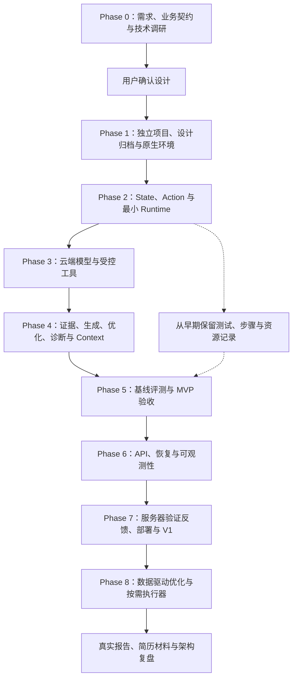
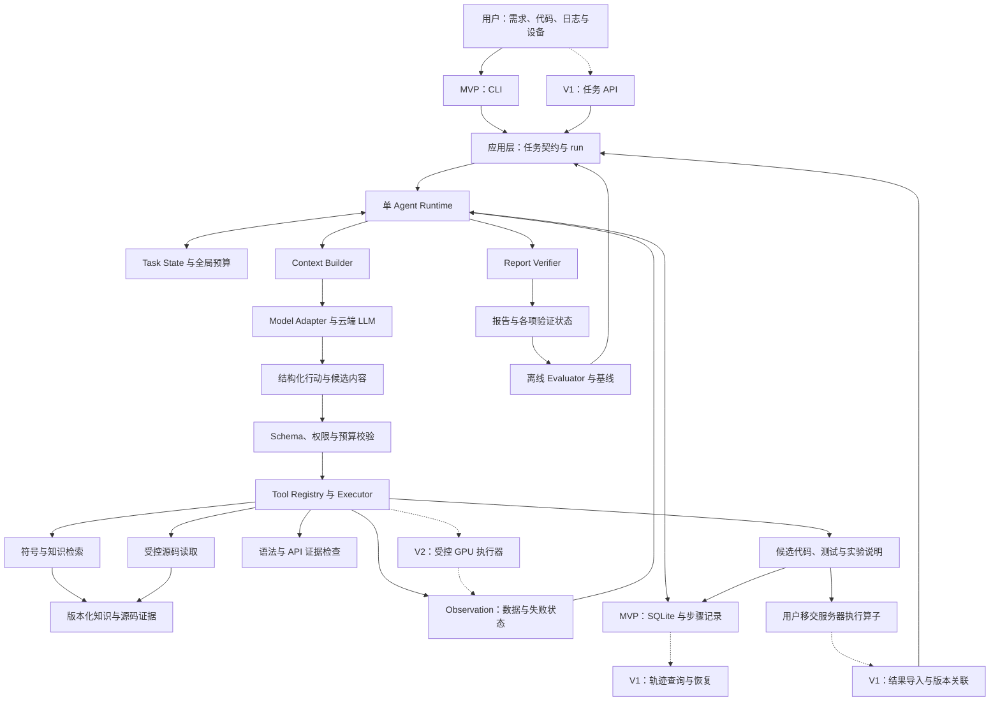
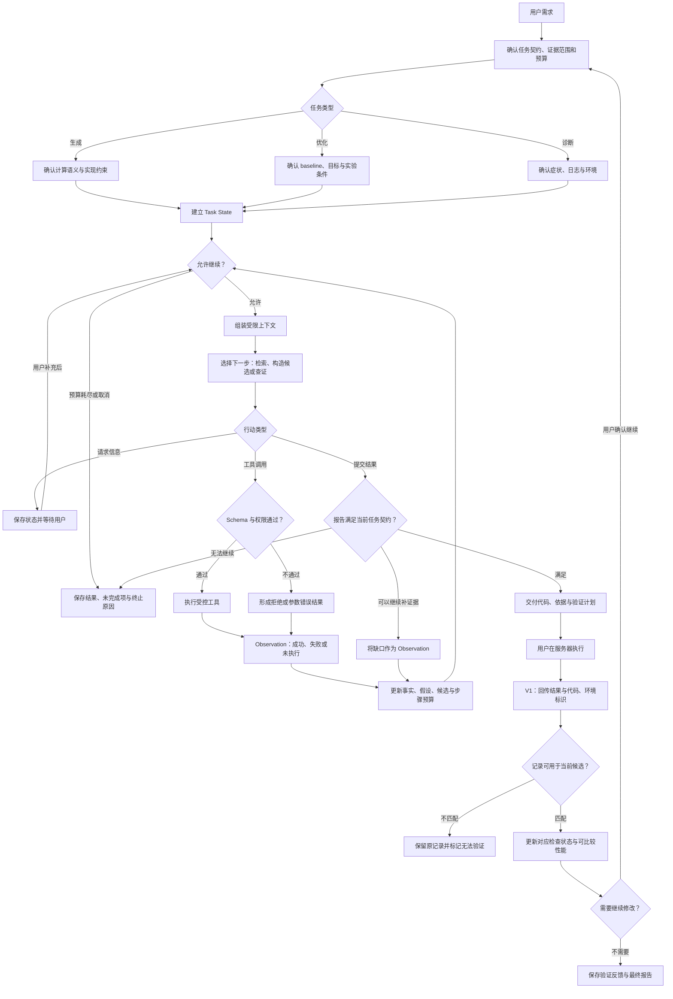
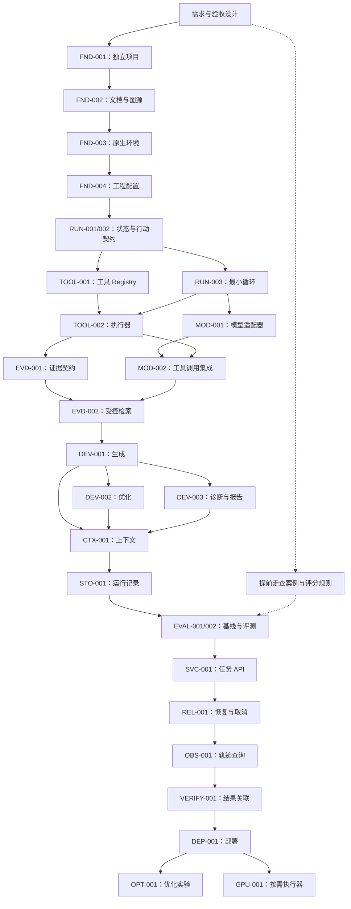
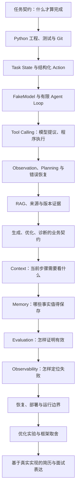

<!-- Generated by scripts/sync_diagrams.py; edit the five diagram .md files instead. -->

# Mermaid 图展示

本页从五个独立 Markdown 图源中的 `mermaid` 代码块生成。图描述目标设计，不代表所有模块已实现。

在 VS Code 中打开本页或下方任意独立图源，按 `⌘⇧V` 打开 Markdown 预览；也可在命令面板选择 `Markdown: Open Preview to the Side`。此格式符合 [Markdown Preview Mermaid Support 的用法](https://marketplace.visualstudio.com/items?itemName=bierner.markdown-mermaid)。

编辑图源后，在项目根运行 `python3 scripts/sync_diagrams.py`；用 `python3 scripts/sync_diagrams.py --check` 检查是否同步。同步检查不代替 Mermaid 解析或渲染检查。

产品范围见 [Agent 原理](../agent-guide.md#overview)，实际状态见 [当前能力与验证范围](../status.md)。

## development-flow

项目开发流程。独立预览与编辑：[development-flow.md](development-flow.md)。

## system-architecture

Agent 系统架构。独立预览与编辑：[system-architecture.md](system-architecture.md)。

## agent-runtime

Agent 运行与验证反馈。独立预览与编辑：[agent-runtime.md](agent-runtime.md)。

## dependency-graph

项目任务依赖。独立预览与编辑：[dependency-graph.md](dependency-graph.md)。

## learning-path

Agent Engineering 学习路径。独立预览与编辑：[learning-path.md](learning-path.md)。

