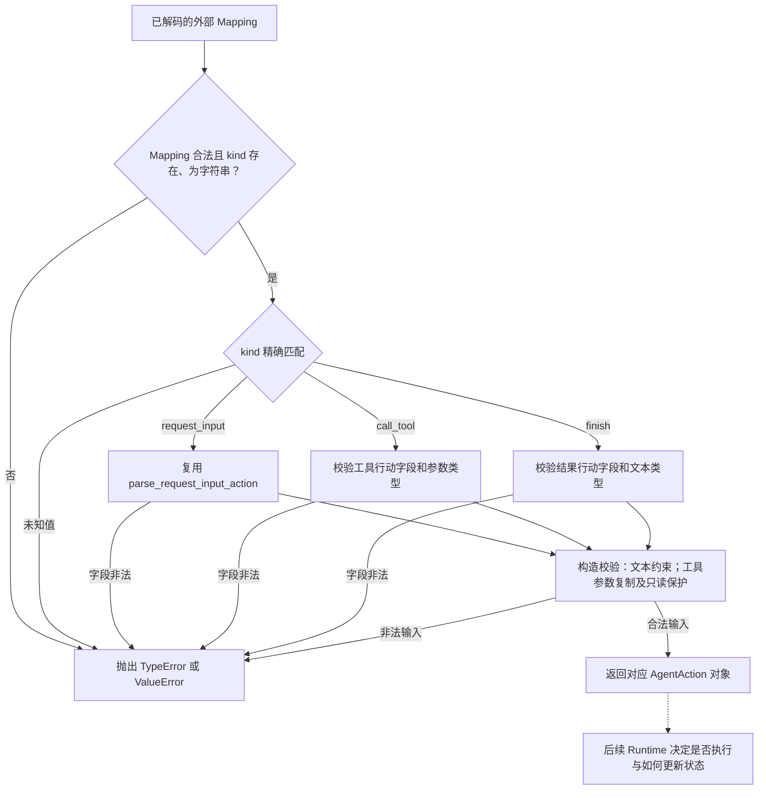

# 行动解析与执行边界：RUN-002D

在 VS Code 中使用 Markdown 预览查看。该文件是本单元的唯一图源，不加入五张总览图的生成展示页。

```mermaid
flowchart TD
    A["已解码的外部 Mapping"] --> B{"Mapping 合法且 kind 存在、为字符串？"}
    B -->|否| X["抛出 TypeError 或 ValueError"]
    B -->|是| C{"kind 精确匹配"}
    C -->|request_input| D["复用 parse_request_input_action"]
    C -->|call_tool| E["校验工具行动字段和参数类型"]
    C -->|finish| F["校验结果行动字段和文本类型"]
    C -->|未知值| X
    D --> G["构造校验：文本约束；工具参数复制及只读保护"]
    E --> G
    F --> G
    D -->|字段非法| X
    E -->|字段非法| X
    F -->|字段非法| X
    G -->|非法输入| X
    G -->|合法输入| H["返回对应 AgentAction 对象"]
    H -.-> I["后续 Runtime 决定是否执行与如何更新状态"]
```

kind 是程序协议标签，不进行大小写修正或猜测。Parser 只产生行动对象或抛异常；
没有工具调用、任务状态更新、异常重试或模型调用。虚线表示后续集成。
