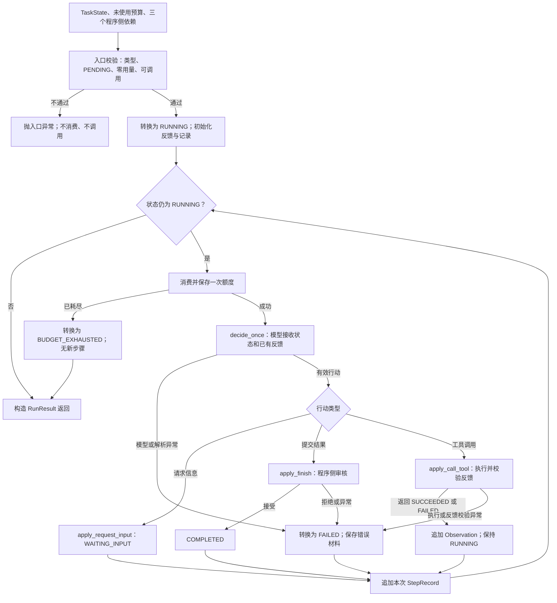

# 有限 Agent Loop 与自动记录

RUN-003H 独立图源，配套 [有限循环讲义](../agent-loop.md)。
在 VS Code 使用 Markdown Preview Mermaid Support 预览本文件。
此图对应 RUN-003H 已实现并验收的控制流程；最新状态见 [当前能力与验证范围](../status.md)。

只有已消费额度的决策尝试才追加记录；完成或等待后不再消费下一次额度。
工具返回 FAILED 是可供下一轮决策的反馈；抛出 Exception 则按首版策略记录失败并停止。
图中的异常路径指当前决策／行动处理范围；KeyboardInterrupt、进程终止和记录不变量异常不转换为正常结果。
次数上限约束尝试数量，不提供回调超时、Token 限制、输入恢复或持久化。
