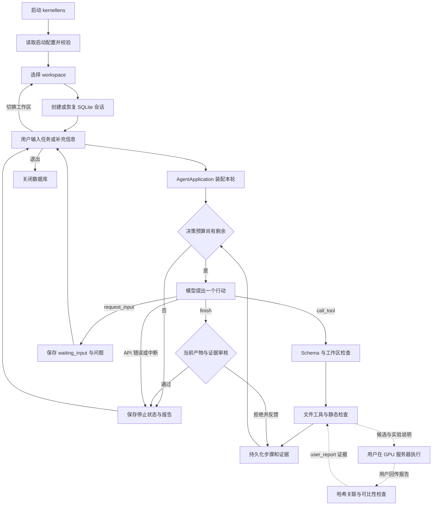

# CLI Agent 运行与证据流

此文件是本专项图的唯一图源，不加入原五图展示页。

```mermaid
flowchart TD
    Start[启动 kernellens] --> Config[读取启动配置并校验]
    Config --> Select[选择 workspace]
    Select --> Session[创建或恢复 SQLite 会话]
    Session --> Input[用户输入任务或补充信息]
    Input --> App[AgentApplication 装配本轮]
    App --> Budget{决策预算尚有剩余}
    Budget -->|否| Stop[保存停止状态与报告]
    Budget -->|是| Model[模型提出一个行动]
    Model -->|call_tool| Guard[Schema 与工作区检查]
    Guard --> Tools[文件工具与静态检查]
    Tools --> Record[持久化步骤和证据]
    Record --> Budget
    Model -->|request_input| Wait[保存 waiting_input 与问题]
    Wait --> Input
    Model -->|finish| Review{当前产物与证据审核}
    Review -->|拒绝并反馈| Record
    Review -->|通过| Stop
    Model -->|API 错误或中断| Stop
    Stop --> Input
    Input -->|切换工作区| Select
    Input -->|退出| End[关闭数据库]
    Tools -.候选与实验说明.-> Server[用户在 GPU 服务器执行]
    Server -.用户回传报告.-> Reports[哈希关联与可比性检查]
    Reports -.user_report 证据.-> Tools
```

`completed` 与 GPU 运行通过分开。AST 与 GEMM 声明检查不执行代码，服务器报告也保留外部来源标记。运行图的实际接口与边界见 [ADR 002](../decisions/002-cli-agent.md)。
