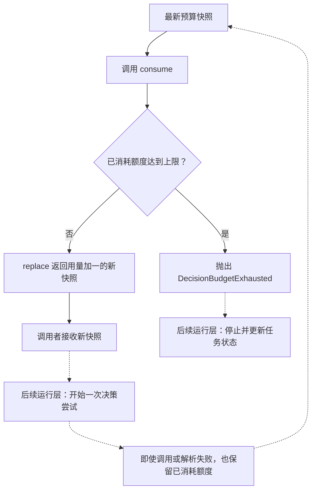

# 决策次数预算

RUN-003B 的独立图源，配套 [预算讲义](../decision-budget.md)。
在 VS Code 使用 Markdown Preview Mermaid Support 预览本文件。

实线展示本单元的预算操作；虚线展示未来调用顺序与停止处理，尚未集成到 Runtime。
额度上限为 2 时，两次 consume 成功，第三次失败。额度消耗不证明模型实际执行，
也不能代替 Token、费用或时间限制。
