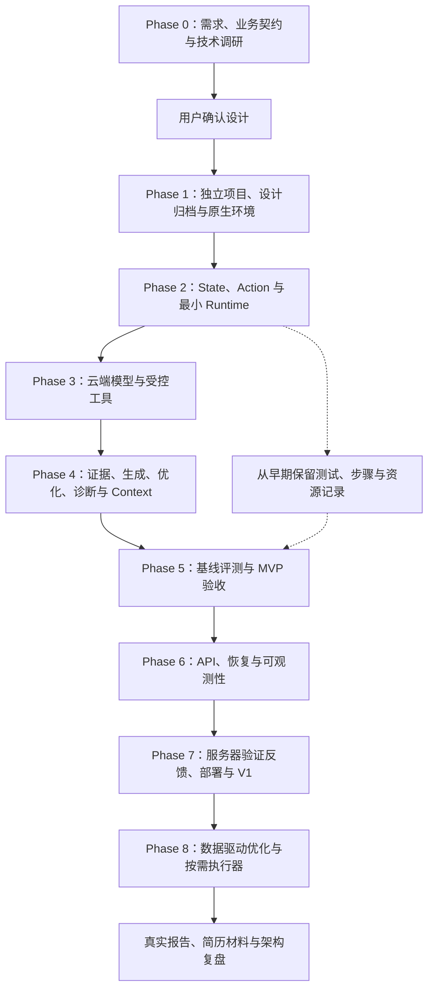

# 项目开发流程

在 VS Code 中打开本文件，使用 Markdown 预览查看。此图描述目标设计，当前实现状态见 [当前能力与验证范围](../status.md)。

[返回图展示页](README.md)

```mermaid
flowchart TD
    P0["Phase 0：需求、业务契约与技术调研"] --> REVIEW["用户确认设计"]
    REVIEW --> P1["Phase 1：独立项目、设计归档与原生环境"]
    P1 --> P2["Phase 2：State、Action 与最小 Runtime"]
    P2 --> P3["Phase 3：云端模型与受控工具"]
    P3 --> P4["Phase 4：证据、生成、优化、诊断与 Context"]
    P4 --> P5["Phase 5：基线评测与 MVP 验收"]
    P5 --> P6["Phase 6：API、恢复与可观测性"]
    P6 --> P7["Phase 7：服务器验证反馈、部署与 V1"]
    P7 --> P8["Phase 8：数据驱动优化与按需执行器"]
    P2 -.-> EARLY["从早期保留测试、步骤与资源记录"]
    EARLY -.-> P5
    P8 --> EVIDENCE["真实报告、简历材料与架构复盘"]
```
