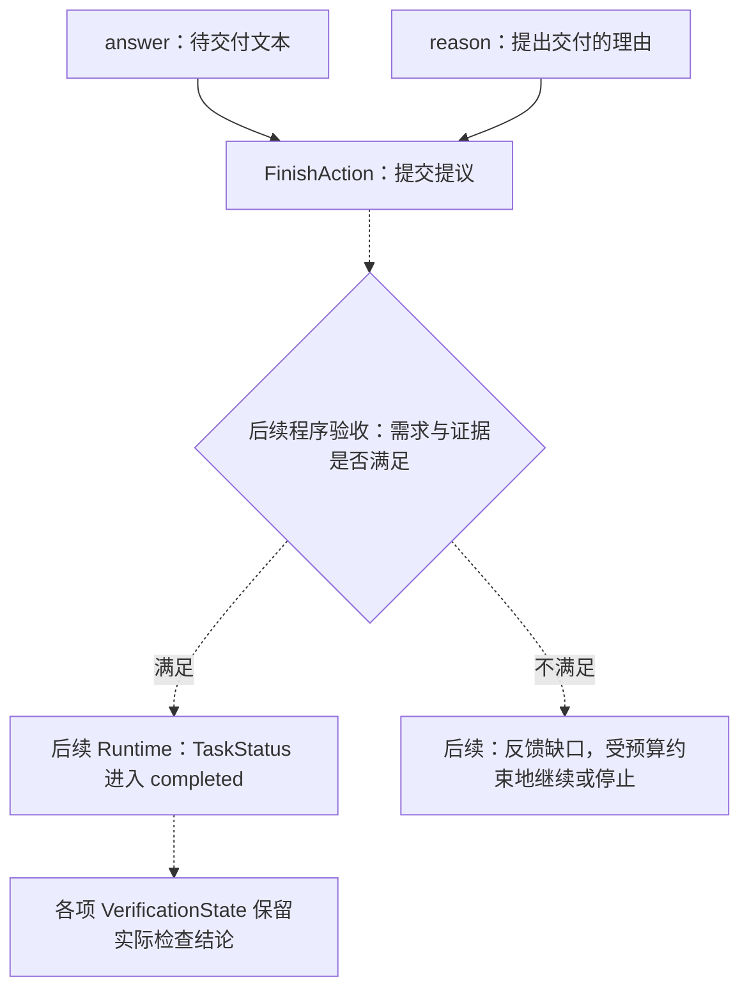

# 结果提交与任务完成：RUN-002C

本文件是专项图的唯一图源，可在 VS Code 使用 Markdown Preview Mermaid Support 预览；不参与五张总览图的展示页生成。
实线为本单元要表达的提议结构，虚线为后续程序验收与状态处理。实际进度见 [当前能力与验证范围](../status.md)。

构造 FinishAction 不代表通过右侧验收。模型给出的提交理由不自动成为证据，任务完成也不自动把检查结果改为 PASSED。
