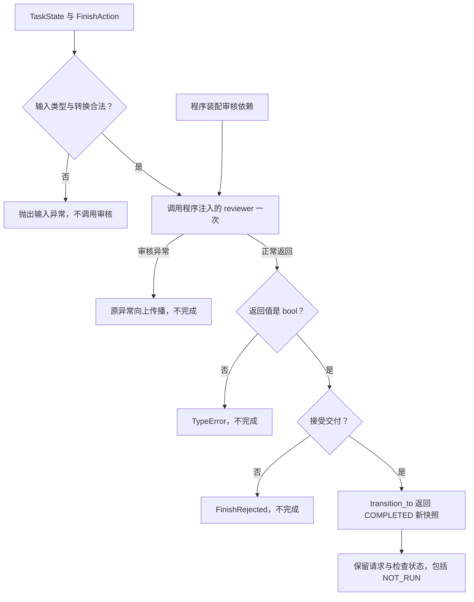

# 完成提议与程序审核

RUN-003D 独立图源，配套 [完成处理讲义](../finish-handler.md)。
在 VS Code 使用 Markdown Preview Mermaid Support 预览本文件。

拒绝或异常路径不产生完成快照。COMPLETED 不等于编译、正确性或性能检查通过。
当前 reviewer 使用测试替身验证控制边界，真实报告审核、拒绝反馈与运行循环后续接入。
