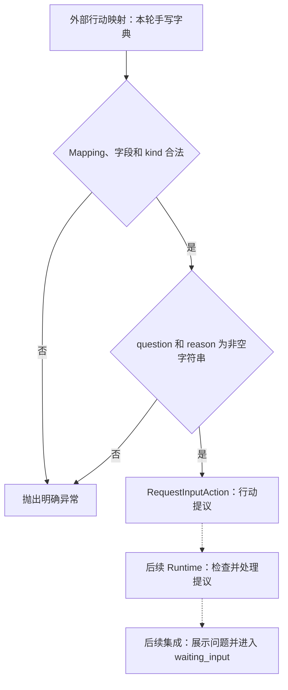

# 补充信息行动的边界：RUN-002A

本文件是该专项图的唯一图源，可在 VS Code 用 Markdown Preview Mermaid Support 预览；不参与五张总览图的展示页生成。
实线为本单元已实现的解析流程，虚线为后续集成方向；实际进度见 [当前能力与验证范围](../status.md)。

创建行动本身不发送问题、不改变 TaskState；Parser 也不判断问题是否必要或理由是否真实。
