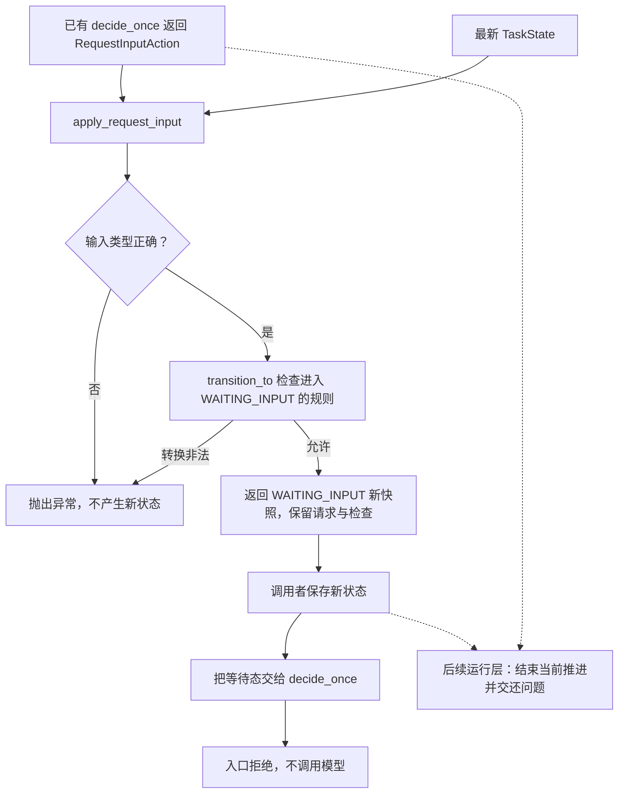

# 请求信息行动与等待状态

RUN-003C 独立图源，配套 [行动处理讲义](../request-input-handler.md)。
在 VS Code 使用 Markdown Preview Mermaid Support 预览本文件。

本单元实现处理函数，并用显式组合验证暂停后的决策入口行为。
虚线为后续应用层和循环的职责；原行动保存问题，TaskState 当前不保存待回答内容。
不是线程挂起或用户输入界面；预算、恢复和完整循环尚未串联。
