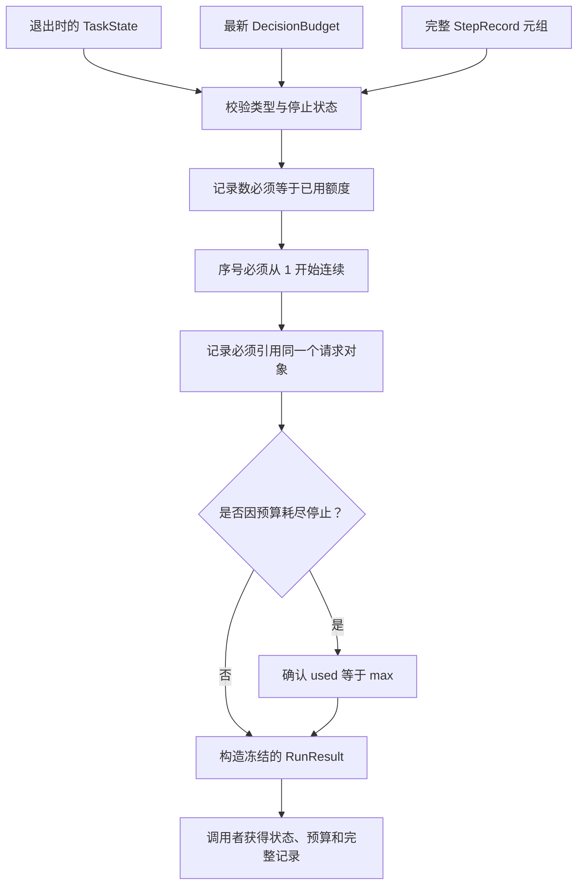

# 运行结果的组合与一致性检查

RUN-003G 独立图源，配套 [运行结果讲义](../run-result.md)。
在 VS Code 使用 Markdown Preview Mermaid Support 预览本文件。

任一校验失败均抛异常，不修补记录、重置预算或改写状态。
预算耗尽前未开始的新决策没有记录，因此最后步骤可为 RUNNING，而最终结果为 BUDGET_EXHAUSTED。
用完额度时已完成任务，结果仍可为 COMPLETED。当前是组合契约，不认证实际运行或实现循环。
