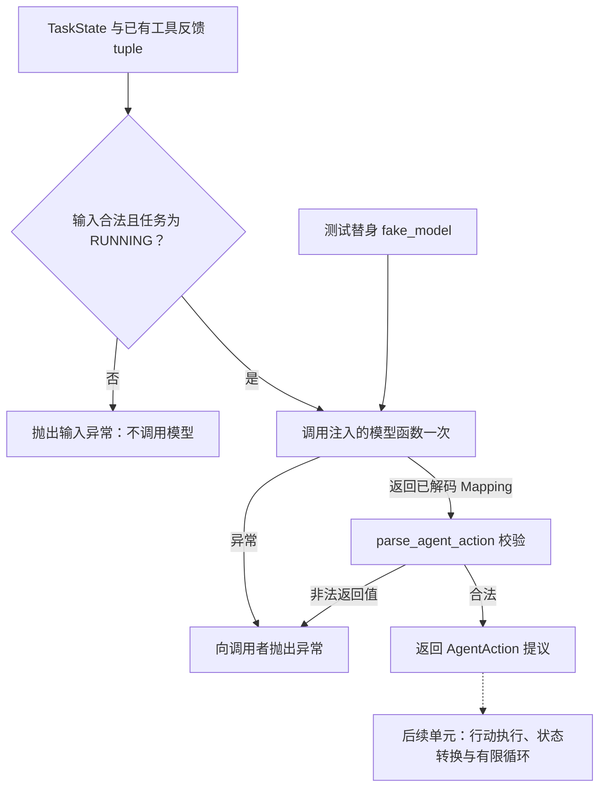

# 一次模型决策流程

RUN-003A 的独立图源。使用 VS Code 的 Markdown Preview Mermaid Support 预览本文件。
接口和参考代码见 [讲义](../runtime-decision.md)；这是当前设计，不代表已实现完整 Runtime。

当前 step 不执行工具、不更新状态、不重试。单次调用不等于完整的时间或成本预算。
测试替身的固定返回值仅用于验证程序边界，未连接真实模型或服务器。
