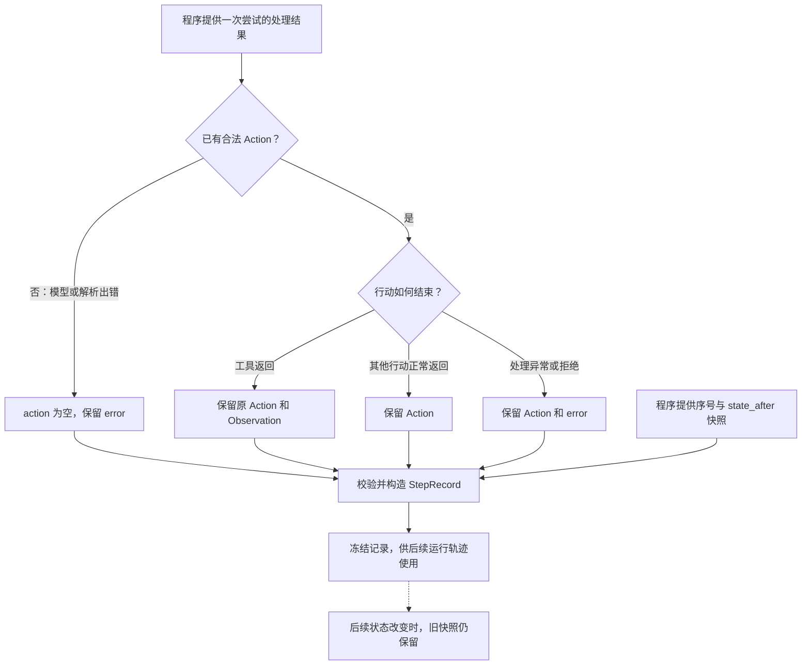

# 一次决策尝试的步骤记录

RUN-003F 独立图源，配套 [步骤记录讲义](../step-record.md)。
在 VS Code 使用 Markdown Preview Mermaid Support 预览本文件。

Observation 包括 SUCCEEDED 和 FAILED；本版正常返回反馈与异常摘要互斥。
图中分支由未来 Runtime 驱动；记录类本身不调用依赖、不改变状态、不自动编号或保存历史。
字段校验不证明执行、转换历史或证据来源真实。
