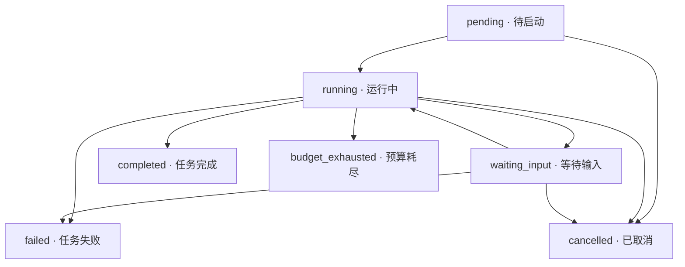

# 任务生命周期：RUN-001B

这是本单元的状态转换设计；实际实现状态见 [当前能力与验证范围](../status.md)。
在 VS Code 中按 `⌘⇧V`，通过 Markdown Preview Mermaid Support 预览。
本文件是生命周期图的唯一图源；五张项目总览图仍由原同步脚本管理，本专项图独立维护。

completed、failed、cancelled、budget_exhausted 是终态，没有出边，包括没有到自身的转换。
图中的边只规定可允许的生命周期变化；请求恢复、预算计量、完成条件和错误判断由后续 Runtime 与相关模块检查。
completed 表示任务交付完成，不能推导出 GPU 编译、数值正确性或性能检查通过。
