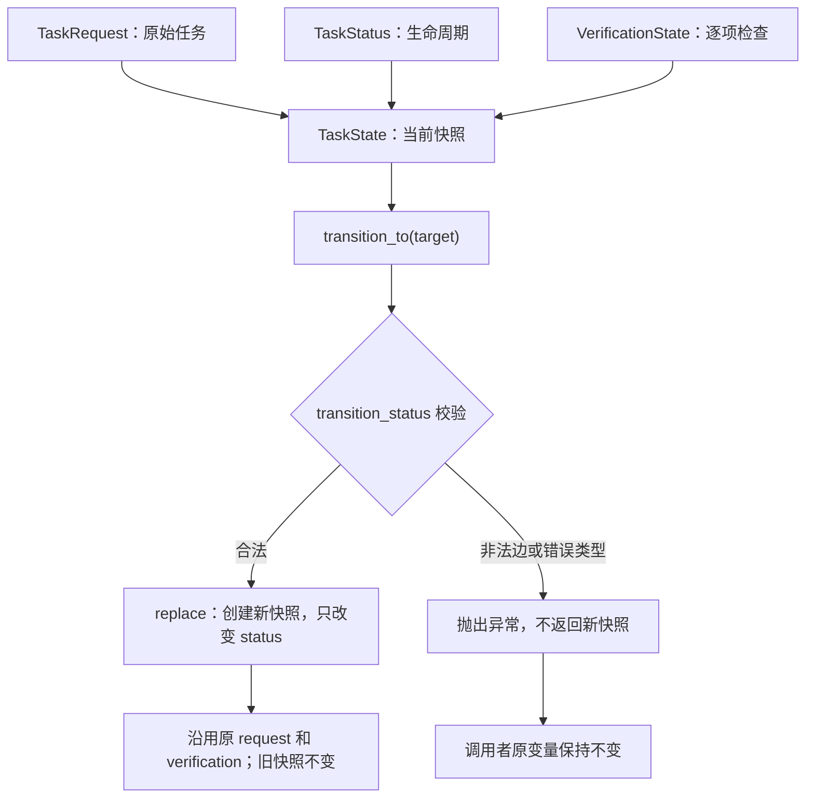

# TaskState 组合与更新：RUN-001D

本文件是该专项图的唯一图源，可用 VS Code Markdown Preview Mermaid Support 预览；不参与五张总览图的展示页生成。
本图描述本单元设计，不表示实现已经完成；实际进度见 [当前能力与验证范围](../status.md)。

调用者接收返回的新快照，才会推进自己持有的状态；此过程不自动保存历史或验证业务交付。
