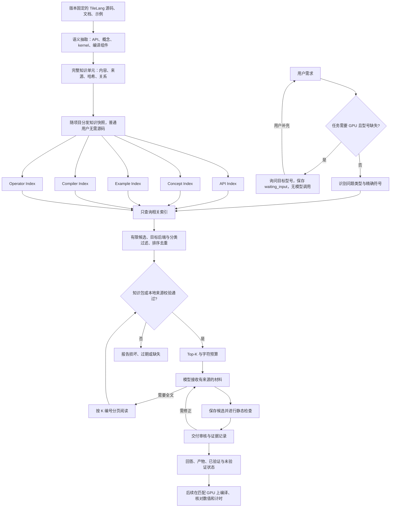

# TileLang RAG 数据与执行流

本文件是专项图的唯一图源，不加入原五图展示页。

```mermaid
flowchart TD
    SRC[版本固定的 TileLang 源码、文档、示例] --> EX[语义抽取：API、概念、kernel、编译组件]
    EX --> UNIT[完整知识单元：内容、来源、哈希、关系]
    UNIT --> PACK[随项目分发知识快照，普通用户无需源码]
    PACK --> API[API Index]
    PACK --> CON[Concept Index]
    PACK --> EXAMPLE[Example Index]
    PACK --> COMP[Compiler Index]
    PACK --> OP[Operator Index]
    Q[用户需求] --> DEVICE{任务需要 GPU 且型号缺失?}
    DEVICE -->|是| ASK[询问目标型号，保存 waiting_input，无模型调用]
    ASK -->|用户补充| Q
    DEVICE -->|否| ROUTE[识别问题类型与精确符号]
    ROUTE --> SELECT[只查询相关索引]
    API --> SELECT
    CON --> SELECT
    EXAMPLE --> SELECT
    COMP --> SELECT
    OP --> SELECT
    SELECT --> RANK[有限候选、目标后端与分类过滤、排序去重]
    RANK --> FRESH{知识包或本地来源校验通过?}
    FRESH -->|是| CTX[Top-K 与字符预算]
    FRESH -->|否| STALE[报告损坏、过期或缺失]
    CTX --> MODEL[模型接收有来源的材料]
    MODEL -->|需要全文| READ[按 K 编号分页阅读]
    READ --> FRESH
    MODEL --> CODE[保存候选并进行静态检查]
    CODE --> REVIEW[交付审核与证据记录]
    REVIEW -->|需修正| MODEL
    REVIEW --> ANSWER[回答、产物、已验证与未验证状态]
    ANSWER --> GPU[后续在匹配 GPU 上编译、核对数值和计时]
```
