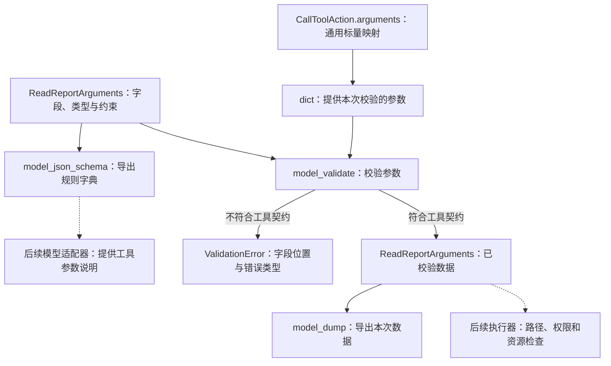

# 工具参数校验与 JSON Schema

TOOL-001A 独立图源，配套 [工具参数讲义](../tool-arguments.md)。
在 VS Code 使用 Markdown Preview Mermaid Support 预览本文件。
当前 ReadReportArguments 待用户实现，实际进度见 [当前能力与验证范围](../status.md)。

同一声明用于数据校验和规则导出；工具名称、版本、注册、调用入口与执行仍是后续单元。
通用行动合法不代表参数适合某个工具；参数结构合法也不代表允许读取对应文件。
图中虚线表示后续接入，不表示已有工具执行或云端模型请求。
