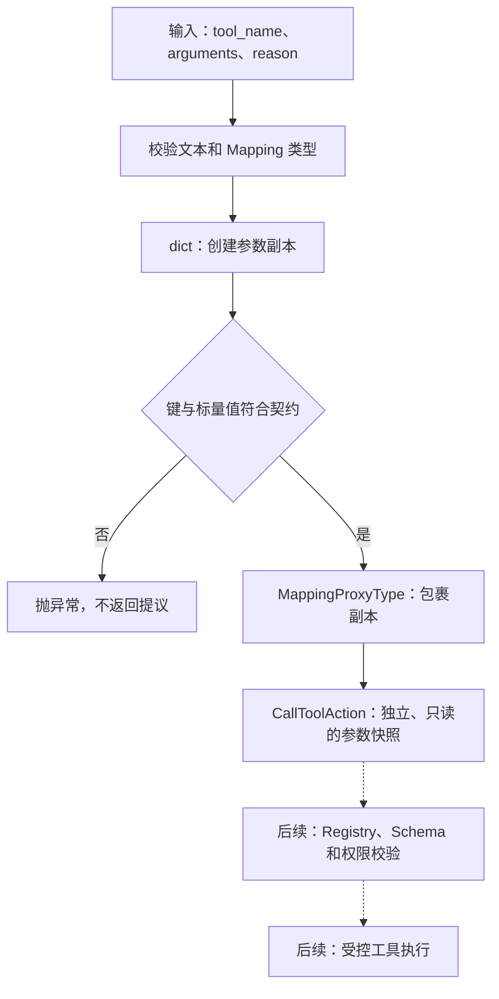

# 工具提议的参数快照：RUN-002B

本文件是该专项图的唯一图源，可在 VS Code 使用 Markdown Preview Mermaid Support 预览；不参与五张总览图的展示页生成。
实线为本单元已实现流程，虚线为后续执行方向；实际进度见 [当前能力与验证范围](../status.md)。

只读视图本身不复制数据；输入字典的独立副本和标量限制共同保证本轮参数不会通过普通容器修改而漂移。
虚线部分尚未实现；构造提议不会调用任何工具。
