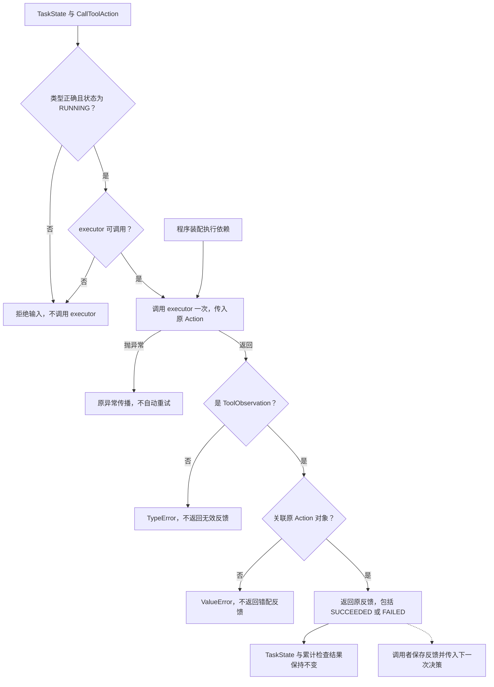

# 工具行动的执行与反馈关联

RUN-003E 独立图源，配套 [工具行动处理讲义](../tool-call-handler.md)。
在 VS Code 使用 Markdown Preview Mermaid Support 预览本文件。

关联检查使用对象身份，不认证证据来源，也不区分同一 Action 的不同执行尝试。
当前用本地函数替身验证调用边界；预算、历史保存、正式执行器和循环后续接入。
