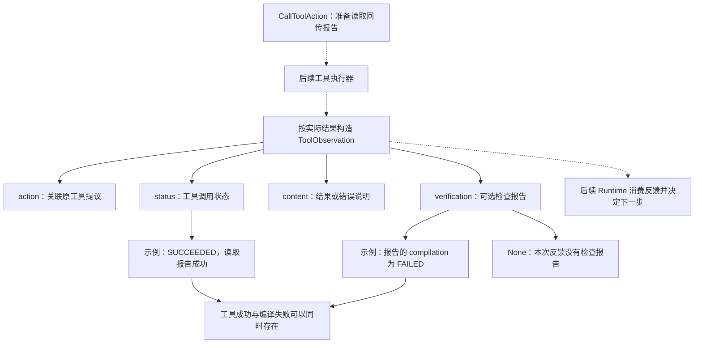

# 工具反馈与检查结论：RUN-002E

该文件是本单元的唯一图源，可在 VS Code Markdown 预览中查看；
不加入五张总览图的生成展示页。

```mermaid
flowchart TD
    A["CallToolAction：准备读取回传报告"] -.-> B["后续工具执行器"]
    B -.-> C["按实际结果构造 ToolObservation"]
    C --> D["action：关联原工具提议"]
    C --> E["status：工具调用状态"]
    C --> F["content：结果或错误说明"]
    C --> G["verification：可选检查报告"]
    E --> H["示例：SUCCEEDED，读取报告成功"]
    G --> I["示例：报告的 compilation 为 FAILED"]
    G --> J["None：本次反馈没有检查报告"]
    H --> K["工具成功与编译失败可以同时存在"]
    I --> K
    C -.-> L["后续 Runtime 消费反馈并决定下一步"]
```

实线展示本轮设计的数据关系；虚线表示后续集成。
示例是手写教学数据，没有发生文件读取或 GPU 检查；
构造反馈不会自动更新 TaskState，也不会认证报告的来源或真实性。
