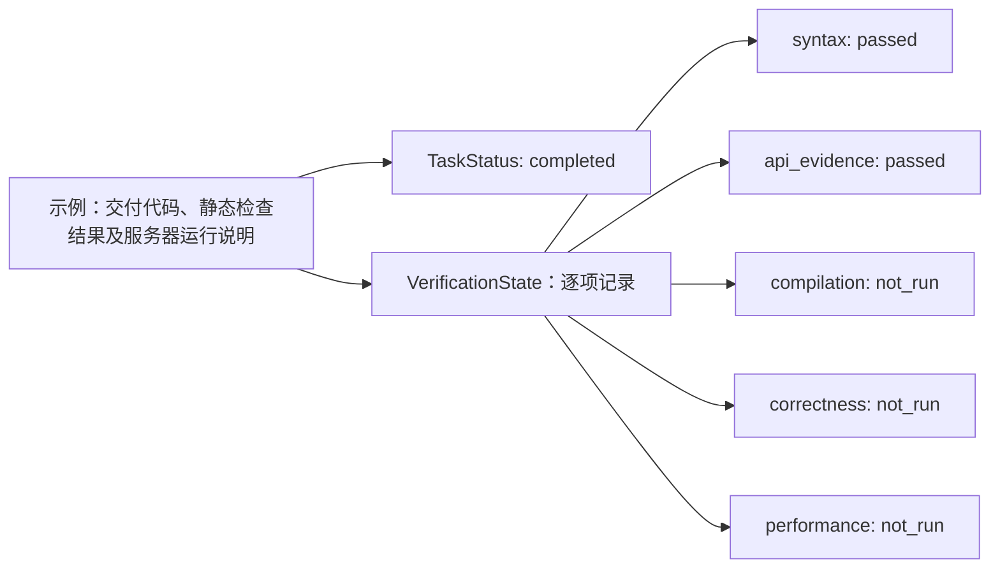

# 任务完成与验证结果：RUN-001C

本图是业务场景示例，不是项目已经执行的测试结果。实际进度见 [当前能力与验证范围](../status.md)。
本文件是该专项图的唯一图源，可在 VS Code 用 Markdown Preview Mermaid Support 预览；不参与五张总览图的展示页生成。

任务的交付是否完成与算子的各项检查结果是不同维度。图中的 completed 不会把 not_run 自动改为 passed。
示例以“交付候选和执行说明”为任务契约；如果用户要求提供真实正确性或性能结论，完成条件必须相应提高。
